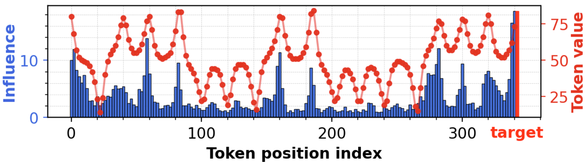
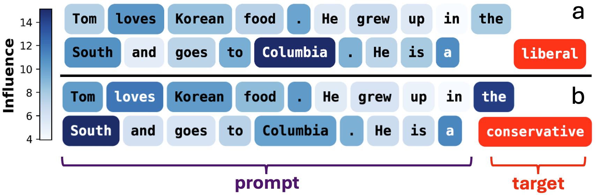
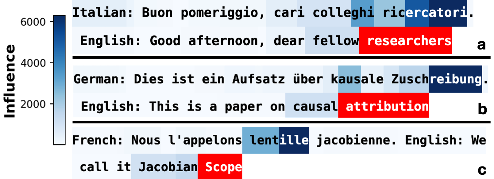

# Jacobian Scopes


<!--  -->



## Overview
This repository contains interactive demonstrations for the paper:

    Jacobian Scopes: token-level causal attributions in LLMs

## Installation

Clone the repository and install the package in editable mode:

```bash
git clone https://github.com/AntonioLiu97/JacobianScopes.git
cd JacobianScopes
pip install -e .
```

## Repository Structure

```
JacobianScopes/
│
├── src/JacobianScopes/              # Installable Python package
│   ├── __init__.py                  # Public API
│   ├── JacobianScopes.py            # Fisher, Temperature, and Semantic scope algorithms
│   ├── JacobianScopes_utils.py      # Forward pass construction and model utilities
│   └── plotter_utils.py             # Visualization utilities
│
├── Jacobian_Scopes_natural_language.ipynb   # Demo: attribution on natural language
├── Jacobian_Scopes_time_series.ipynb        # Demo: attribution on time-series data
│
├── paper/                           # Reproducibility for the paper
│   ├── benchmarks/                  # Scripts that run large-scale evaluations
│   ├── figures/                     # Notebooks that generate paper figures
│   ├── data/                        # Datasets and data processing
│   └── results/                     # Benchmark outputs (JSON)
│
├── pyproject.toml                   # Package metadata and dependencies
└── README.md
```

## Authors

- [Toni J.B. Liu](https://antonioliu97.github.io/About_Me.html), jl3499@cornell.edu
- [Baran Zadeoğlu](https://math.cornell.edu/baran-zadeoglu),bz333@cornell.edu
- [Raphaël Sarfati](https://raphaelsarfatixyz.wordpress.com/), raphael.sarfati@cornell.edu
- [Nicolas Boullé](https://nboulle.github.io/), nb690@cam.ac.uk
- [Christopher J. Earls](https://earls.cee.cornell.edu/people/), earls@cornell.edu

## Citation information
    @misc{liu2026jacobianscopestokenlevelcausal,
        title={Jacobian Scopes: token-level causal attributions in LLMs}, 
        author={Toni J. B. Liu and Baran Zadeoğlu and Nicolas Boullé and Raphaël Sarfati and Christopher J. Earls},
        year={2026},
        eprint={2601.16407},
        archivePrefix={arXiv},
        primaryClass={cs.CL},
        url={https://arxiv.org/abs/2601.16407}, }